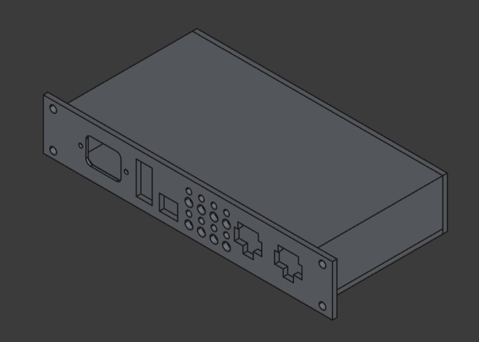

# mini rack pdu
An inexpensive 10" rack mount AC power distribution unit with remote control and power monitoring via esp32. 

  
  

Features
- Current Protection
- Current Monitoring
- Switchable Outlets (physical buttons and remote control)
- Web Interface
- Home Assistant Integration

To-Do
- [ ] Build
- [ ] Write software
  - [ ] Control logic
  - [ ] Web interface
  - [ ] API

BOM
- 8 panel mount outlets (<a href="https://a.co/d/97mr5YT">Amazon</a>)
- Power in C14 plug (<a href="https://a.co/d/73B9O7r">Amazon</a>)
- Main power switch/circuit breaker. (<a href="https://www.mouser.com/ProductDetail/562-736W-B-301">Mouser</a>)
- Relay board (<a href="https://a.co/d/4Hwa2Mm">Amazon</a>)
- Current measuring ACS758 (<a href="https://a.co/d/4qGEHbB">Amazon</a>)
- esp32 WT32-ETH01 (<a href="https://a.co/d/eftOV7s">Amazon</a>) (<a href="https://www.huilyn.com/enus/detail_305_1887.html">ethernet port dimensions</a>)
- I2c gpio extender (<a href="https://www.adafruit.com/product/5346">Adafruit</a>)
- Push buttons (<a href="https://a.co/d/blETPMN">Amazon</a>)
- Leds
- Power board for esp32 and relays. (<a href="https://a.co/d/7kuPYSm">Amazon</a>)
- 3d printed case

References
- <a href="https://www.ti.com/lit/pdf/slvae37">How to select a Surge Diode</a> 
